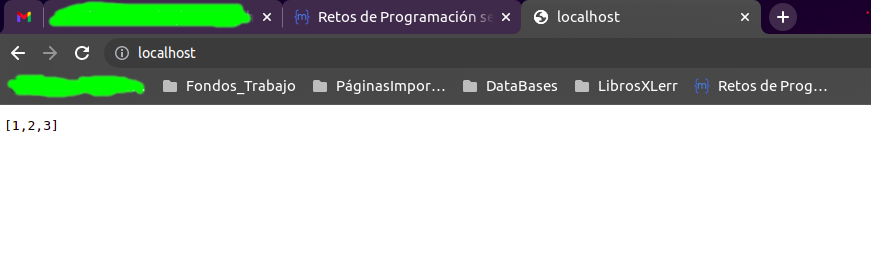
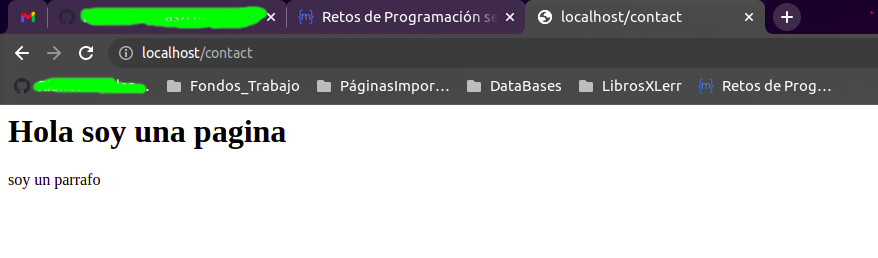

# Game Project

Para ejecutar el juego debes seguir las siguiente instrucciones en la terminal:

```sh
cd game
python3 main.py
```

# App Project

```sh
git clone
cd app
python3 -m venv env
source env/bin/activate
pip3 install /r requirements.txt 
python3 main.py
```

# Dockerizando App Project
Se crean los archivos dentro del directorio app:
- docker-compose.yml
- Dockerfile
```sh
cd app
```

Ahora hay que seguir los siguientes pasos para poder desarrollar dentro del contener de docker.

1. Se debe construir la imagen del contenedor o del sistema
```sh
sudo docker compose build
```
2. Para proceder a lanzar el sistema o crear e iniciar la imagen del contenedor
```sh
sudo docker compose up -d
```
3. Para revisar si hay contenedores
```sh
sudo docker compose ps
```
4. Para ingresar al ambiente dentro del contenedor, hay que tener en cuenta que el nombre de la aplicacion o servicio en este caso es "**app-csv**". Por otro lado, la terminal que requerimos es de tipo **bash**.
```sh
sudo docker compose exec app-csv bash
```
### Ejecuciones dentro del contenedor
Dentro del ambiente de desarrollo del contenedor, se puede ejecutar la aplicación main:
```sh
python main.py
```

### Sincronizando el contenedor con el sistema de archivos
Para facilitar el desarrollo de la aplicación y a medida que se vaya editando los diferentes archivos del proyecto, es posible sincronizar el contenedor para que en tiempo real se actualicen estos archivos.

Para lograr lo anterior, simplemente se agrega al archivo **docker-compose.yml**
```docker
services:
  app-csv:
    build:
      context: .
      dockerfile: Dockerfile
    volumes:
      - .:/app
```

# Web Server Project
```sh
git clone
cd web-server
python3 -m venv env
source env/bin/activate
pip3 install /r requirements.txt 
python3 main.py
```

# Dockerizando Web Server Project
Se crean los archivos dentro del directorio app:
- docker-compose.yml
- Dockerfile
```sh
cd web-server
```

Ahora hay que seguir los siguientes pasos para poder desarrollar dentro del contener de docker.

1. Se debe construir la imagen del contenedor o del sistema
```sh
sudo docker compose build
```
2. Para proceder a lanzar el sistema o crear e iniciar la imagen del contenedor
```sh
sudo docker compose up -d
```
3. Para revisar si hay contenedores
```sh
sudo docker compose ps
```

Ya en este punto el contenedor deberia estar en estado "running" por lo que al dirigirse al navegador en la ruta "**localhost**" en el puerto 80 debe aparecer lo siguiente:



Ahora bien, también se puede revisar la ruta "**localhost/contact**" en el puerto 80 en donde debe arrojar el siguiente resultado:

